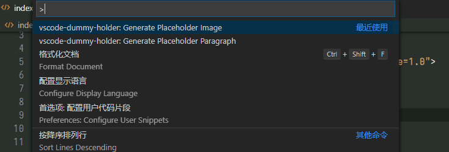

# vscode-dummy-holder



*vscode-dummy-holder* can generate placeholder image URL and paragraphs for frontend developers to debug their page layout easier.

**CLAIM:** Service from [Placeholder.com](https://placeholder.com) is used to generate image URL. Thanks and support them if you want.

## How to use

### Call It Out

Press the button to call VSCode command prompt out (F1 in Windows by default). These two commands is for *vscode-dummy-holder*:

- `Generate Placeholder Image`
- `Generate Placeholder Paragraph`

### Image Placeholder

Just type in your one-line command **in any order you want**. This extension will analyze it smartly. Command is consisted of:

| Attribute        | Optional?               | Example                   |
| ---------------- | ----------------------- | ------------------------- |
| size             | no                      | `300`, `200x300`          |
| background color | yes, gray by default    | `#ccc`, `3f3f3f`, `green` |
| format           | yes, png by default     | `png`, `jpg`, `gif`       |
| text content     | yes, none by default    | `Hello, world!`           |
| text color       | yes, gray by default    | `#ccc`, `3f3f3f`, `green` |
| use https        | yes, enabled by default | `http`, `https`           |

Here are some examples:

```
[1] 300x400 #ccc blue hello, world https
-> a 300x400, gray background, https png image link with blue "hello, world" string
[2] 200 green #3f3f3f http jpg
-> a 200x200, #3f3f3f background (hex color prior), http jpg image link with no text (green is text color but text content is none)
```

Try out your self to discover more.

### Paragraph Placeholder

Type in the length of paragraph you want. Type in `no / false / n / f` if you don't want a multiline one. Here are some examples:

```
[1] 100
-> a multiline string with length no less than 100
[2] 200f
-> a one-line string with length no less than 200
```

## Extension Settings

This extension contributes one setting:

* `vscode-dummy-holder.copy` Copy the generated content (URL or paragraph) to the clipboard. `false` by default to not override your clipboard.

## License

MIT